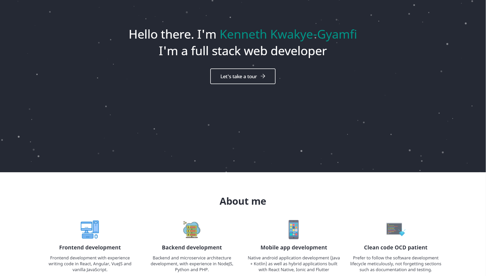

# cross-site

Website for Kenneth Kwakye-Gyamfi, built with [GatsbyJS](https://www.gatsbyjs.org) and React and hosted with ♥ at [Netlify](https://www.netlify.com/). This repository draws inspiration from the following repositories/starter packs:

-   [smartive.ch](https://github.com/smartive/smartive.ch)
-   [Gatsby Starter Default](https://github.com/gatsbyjs/gatsby-starter-default)
-   [Gatsby Netlify CMS Example](https://github.com/erquhart/gatsby-netlify-cms-example)

_I consider myself an intermediate developer at best and is willing to learn from suggestions, pull requests and other inspirations presented to me. Please feel free to drop them whenever possible_

## 🚀 Installation

To install this website locally for modifications,

1. Clone this repository from https://github.com/cr05s19xx/cross-site.

2. Install the npm dependencies by running `npm install` (or `yarn install` if you want to use `yarn`)

3. Run `npm run develop`. Alternatively, if you have the `gatsby-cli` installed globally, you can run `gatsby develop`

4. Visit `http://localhost:8000` to view the website

## 🧐 What's inside the project

A quick look at the top-level files and directories you'll see in a Gatsby project.

    .
    ├── node_modules
    ├── src
    ├── .gitignore
    ├── gatsby-config.js
    ├── LICENSE
    ├── package-lock.json
    ├── package.json
    └── README.md

1.  **`/node_modules`**: This directory contains all of the modules of code that your project depends on (npm packages) are automatically installed.

2.  **`/src`**: This directory will contain all of the code related to what you will see on the front-end of your site (what you see in the browser) such as your site header or a page template. `src` is a convention for “source code”.

3.  **`.gitignore`**: This file tells git which files it should not track / not maintain a version history for.

4.  **`gatsby-config.js`**: This is the main configuration file for a Gatsby site. This is where you can specify information about your site (metadata) like the site title and description, which Gatsby plugins you’d like to include, etc. (Check out the [config docs](https://www.gatsbyjs.org/docs/gatsby-config/) for more detail).

5.  **`LICENSE`**: This project is licensed under the MIT license.

6.  **`package-lock.json`** (See `package.json` below, first). This is an automatically generated file based on the exact versions of your npm dependencies that were installed for your project. **(You won’t change this file directly).**

7.  **`package.json`**: A manifest file for Node.js projects, which includes things like metadata (the project’s name, author, etc). This manifest is how npm knows which packages to install for your project.

8.  **`README.md`**: A text file containing useful reference information about your project.

## 🎓 Learning Gatsby

Looking for more guidance? Full documentation for Gatsby lives [on the website](https://www.gatsbyjs.org/). Here are some places to start:

-   **For most developers, we recommend starting with our [in-depth tutorial for creating a site with Gatsby](https://www.gatsbyjs.org/tutorial/).** It starts with zero assumptions about your level of ability and walks through every step of the process.

-   **To dive straight into code samples, head [to our documentation](https://www.gatsbyjs.org/docs/).** In particular, check out the _Guides_, _API Reference_, and _Advanced Tutorials_ sections in the sidebar.
